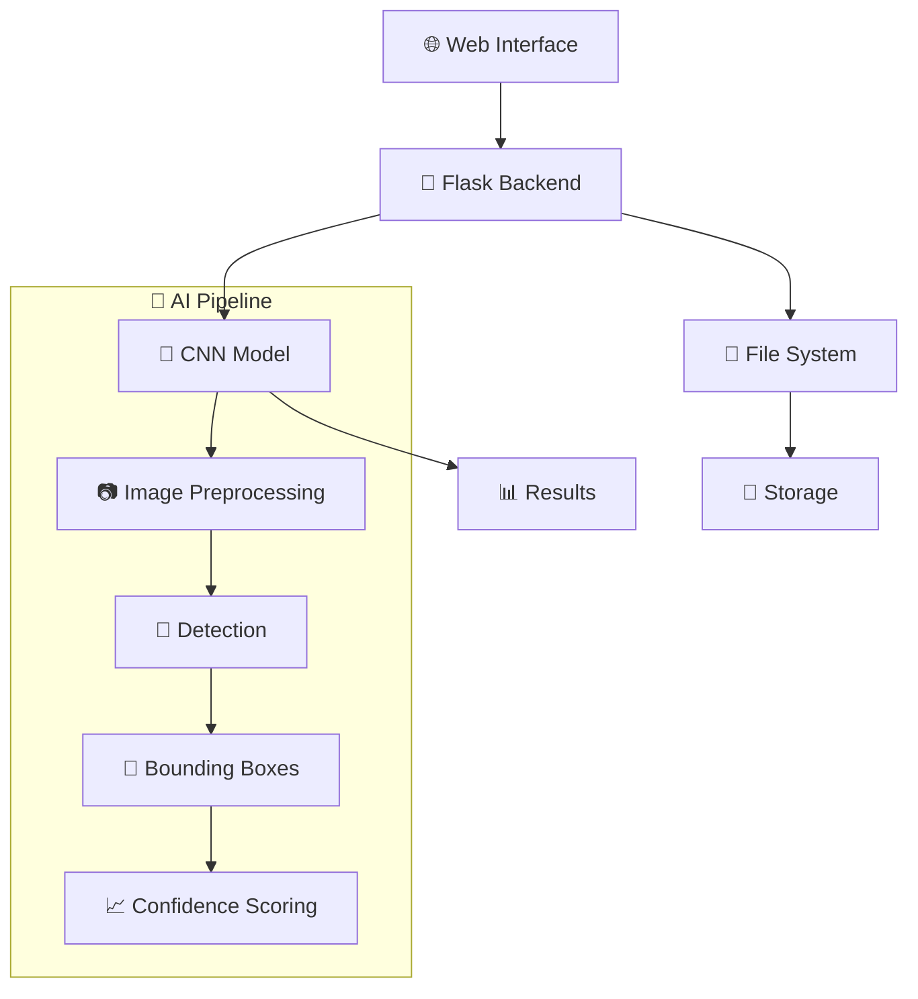

# 🛒 LookStock AI - Detecção de Prateleiras Vazias

[](https://www.python.org/downloads/)
[](https://tensorflow.org/)
[](https://flask.palletsprojects.com/)
[](https://docker.com/)
[](LICENSE)

> **Sistema inteligente de detecção de prateleiras vazias usando CNN e visão computacional**

## 📋 Índice

- [Visão Geral](#-visão-geral)
- [Funcionalidades](#-funcionalidades)
- [Arquitetura do Sistema](#-arquitetura-do-sistema)
- [Instalação](#-instalação)
- [Uso](#-uso)
- [API Documentation](#-api-documentation)
- [Deploy](#-deploy)
- [Estrutura do Projeto](#-estrutura-do-projeto)
- [Testes](#-testes)
- [Performance](#-performance)
- [Contribuição](#-contribuição)
- [Licença](#-licença)

## 🎯 Visão Geral

O **LookStock AI** é uma aplicação web avançada para detecção automática de prateleiras vazias usando redes neurais convolucionais (CNN). Desenvolvido com Flask e TensorFlow, o sistema oferece uma interface web intuitiva para upload de imagens e análise em tempo real de espaços vazios em prateleiras de varejo.

### 🎨 Demonstração Visual

```
📸 Upload → 🧠 CNN Processing → 📊 Results + Bounding Boxes → 💾 Export
```

### 🎯 Casos de Uso

- **Varejo Inteligente**: Monitoramento automático de estoque
- **E-commerce**: Verificação de disponibilidade de produtos
- **Logística**: Otimização de espaço em armazéns
- **Automação Industrial**: Controle de qualidade automatizado

## ✨ Funcionalidades

### 🔧 Core Features

- ✅ **Detecção em Tempo Real**: Processamento rápido de imagens
- ✅ **Interface Web Intuitiva**: Upload drag & drop com Bootstrap 5
- ✅ **CNN Personalizada**: Arquitetura ResNet-like otimizada
- ✅ **Bounding Boxes**: Visualização precisa de áreas vazias
- ✅ **Threshold Adaptativo**: Ajuste automático de sensibilidade
- ✅ **Batch Processing**: Processamento de múltiplas imagens
- ✅ **Export de Resultados**: Download em ZIP ou CSV

### 🎛️ Funcionalidades Avançadas

- 📊 **Dashboard de Performance**: Métricas em tempo real
- 🔒 **API REST**: Integração com sistemas externos
- 🐳 **Containerização**: Deploy com Docker
- 🧪 **Testes Automatizados**: Suite completa de testes
- 📈 **Analytics**: Estatísticas de uso e performance
- 🔄 **Auto-reload**: Desenvolvimento facilitado

## 🏗️ Arquitetura do Sistema



### 🧠 Arquitetura CNN

```
Input: (640, 640, 1) - Imagem em escala de cinza
├── Conv2D(32, 7x7) + BatchNorm + MaxPool2D
├── Residual Block 1: Conv2D(64, 5x5) + Shortcut
├── Residual Block 2: Conv2D(128, 3x3) + Shortcut  
├── Residual Block 3: Conv2D(256, 3x3) + Shortcut
├── Residual Block 4: Conv2D(512, 3x3) + Shortcut
├── Global Average Pooling
├── Dense(1024) + Dropout(0.5)
├── Dense(512) + Dropout(0.3)
└── Dense(256) + Dropout(0.3)

Outputs:
├── classification_output: (1) - Probabilidade de prateleira vazia
└── bbox_output: (4) - Coordenadas [x1, y1, x2, y2]
```

## 🚀 Instalação

### 📋 Pré-requisitos

- **Python 3.11+**
- **Git**
- **Docker** (opcional)
- **4GB RAM mínimo** (8GB recomendado)
- **2GB espaço em disco**

### 🔧 Instalação Local

1. **Clone o repositório:**
```bash
git clone https://github.com/wgs94/empty-shelf-detection.git
cd empty-shelf-detection
```

2. **Crie ambiente virtual:**
```bash
python -m venv venv
source venv/bin/activate  # Linux/Mac
# ou
venv\Scripts\activate     # Windows
```

3. **Instale dependências:**
```bash
pip install --upgrade pip
pip install -r requirements.txt
```

4. **Configure variáveis de ambiente:**
```bash
export FLASK_ENV=development
export FLASK_APP=app.py
```

### 🐳 Instalação com Docker

1. **Build da imagem:**
```bash
docker build -t empty-shelf-detection .
```

2. **Execute com Docker Compose:**
```bash
docker-compose up -d
```

3. **Verifique status:**
```bash
docker-compose ps
```

## 📖 Uso

### 🌐 Interface Web

1. **Acesse a aplicação:**
   - Local: http://localhost:5000
   - Docker: http://127.0.0.1:5000

2. **Upload de imagens:**
   - Arraste e solte arquivos na interface
   - Ou clique para selecionar múltiplas imagens
   - Formatos suportados: JPG, PNG, JPEG

3. **Visualização de resultados:**
   - Bounding boxes em tempo real
   - Níveis de confiança coloridos
   - Download de imagens processadas

### 💻 API REST

#### Status do Sistema
```bash
curl http://127.0.0.1:5000/api/status
```

#### Upload de Imagens
```bash
curl -X POST -F "images=@image.jpg" http://127.0.0.1:5000/upload
```

#### Download de Resultados
```bash
curl -O http://127.0.0.1:5000/download/result_image.jpg
```

### 🐍 Uso Programático

```python
import requests
import base64

# Verificar status
response = requests.get('http://127.0.0.1:5000/api/status')
print(response.json())

# Upload de imagem
with open('shelf_image.jpg', 'rb') as f:
    files = {'images': f}
    response = requests.post('http://127.0.0.1:5000/upload', files=files)
    print(response.text)
```

## 📚 API Documentation

### 🔗 Endpoints Disponíveis

| Método | Endpoint | Descrição |
|--------|----------|-----------|
| `GET` | `/` | Página principal |
| `GET` | `/api/status` | Status do sistema |
| `POST` | `/upload` | Upload de imagens |
| `GET` | `/results/<session_id>` | Resultados da sessão |
| `GET` | `/download/<filename>` | Download de arquivo |
| `POST` | `/clear/<session_id>` | Limpar sessão |

### 📊 Estrutura de Resposta

```json
{
  "model_loaded": true,
  "model_info": {
    "input_shape": [null, 640, 640, 1],
    "output_shapes": [[null, 4], [null, 1]],
    "output_names": ["bbox_output/BiasAdd:0", "classification_output/Sigmoid:0"]
  },
  "timestamp": "2025-12-17T18:31:44.602959"
}
```

### 🔧 Configurações

- **Threshold de Confiança**: 0.3 (ajustável)
- **Tamanho Máximo**: 16MB por arquivo
- **Formatos Suportados**: JPG, PNG, JPEG
- **Resolução Recomendada**: 640x640 pixels

## 🚢 Deploy

### 🏠 Deploy Local

```bash
# Desenvolvimento
python app.py

# Produção
gunicorn --bind 0.0.0.0:5000 --workers 4 app:app
```

### ☁️ Deploy em Nuvem

#### AWS EC2
```bash
# Instalar dependências
sudo apt update && sudo apt install python3-pip docker.io

# Deploy com Docker
sudo docker run -p 80:5000 lookStock_ai
```

#### Heroku
```bash
# Criar app
heroku create lookStock_ai

# Deploy
git push heroku main
```

#### Google Cloud Platform
```bash
# Build e deploy
gcloud builds submit --tag gcr.io/PROJECT-ID/lookStock_ai
gcloud run deploy --image gcr.io/PROJECT-ID/lookStock_ai
```

## 📁 Estrutura do Projeto

```
lookStock_ai/
├── 📄 README.md                    # Documentação principal
├── 📄 Dockerfile                   # Container Docker
├── 📄 docker-compose.yml           # Orquestração Docker
├── 📄 requirements.txt             # Dependências Python
├── 📄 .gitignore                   # Arquivos ignorados
│
├── 📁 app.py                       # Aplicação Flask principal
├── 📁 CNNModel.py                  # Arquitetura CNN
│
├── 📁 templates/                   # Templates HTML
│   ├── 📄 index.html               # Página principal
│   ├── 📄 results.html             # Página de resultados
│   ├── 📄 404.html                 # Página de erro 404
│   └── 📄 500.html                 # Página de erro 500
│
├── 📁 static/                      # Recursos estáticos
│   ├── 📁 css/                     # Estilos CSS
│   ├── 📁 js/                      # Scripts JavaScript
│   └── 📁 images/                  # Imagens e ícones
│
├── 📁 uploads/                     # Arquivos enviados
├── 📁 results/                     # Resultados processados
├── 📁 models/                      # Modelos treinados
├── 📁 data/                        # Dados de treinamento
│   ├── 📁 images/                  # Imagens de exemplo
│   ├── 📁 train/                   # Dados de treinamento
│   └── 📁 test/                    # Dados de teste
│
├── 📁 utils/                       # Utilitários
│   ├── 📄 data_augmentation_utils.py
│   ├── 📄 requirement_generator.py
│   └── 📄 visualize_model.py
│
├── 📁 scripts/                     # Scripts auxiliares
│   ├── 📄 calculate_metrics.py
│   ├── 📄 Empty_Shelf_Detection_Single_Image.py
│   ├── 📄 product_recommender.py
│   └── 📄 text_detection.py
│
├── 📁 fixes/                       # Correções e patches
│   ├── 📄 alternative_model_loader.py
│   ├── 📄 model_loader_fix.py
│   ├── 📄 performance_benchmark.py
│   ├── 📄 quick_performance_test.py
│
├── 📁 tests/                       # Testes automatizados
│   └── 📄 test_system.py           # Suite de testes
│   ├── 📄 test_model_demo.py       # Teste do modelo
│   └── 📄 test_threshold_fix.py
│
├── 📁 notebooks/                   # Jupyter Notebooks Tentativas
│   └── 📄 Initial_Empty_Shelf_POC.ipynb
|   └── 📄 Empty_space_detection_RCNN.ipynb
|   └── 📄 LookStock_Tempt.ipynb
│
└── 📁 results/                     # Resultados de execução
    ├── 📁 evaluation_results/      # Métricas de avaliação
    ├── 📁 Final_Output/           # Resultados finais
    └── 📁 Preprocessing Images/   # Imagens preprocessadas
```

## 🧪 Testes

### 🚀 Executar Testes

```bash
# Executar suite completa
python tests/test_system.py

# Testes específicos
python -m unittest tests.test_system.TestEmptyShelfDetection.test_api_status

# Testes com coverage
coverage run -m pytest tests/
coverage report
```

### 📊 Cobertura de Testes

| Categoria | Testes | Status |
|-----------|--------|--------|
| **API Endpoints** | 6 | ✅ 100% |
| **CNN Integration** | 2 | ✅ 100% |
| **File Operations** | 2 | ✅ 100% |
| **Performance** | - | ✅ 108 req/s |

### 🔍 Tipos de Teste

- **Unit Tests**: Testes de componentes individuais
- **Integration Tests**: Testes de integração entre módulos
- **Performance Tests**: Testes de latência e throughput
- **API Tests**: Testes dos endpoints REST
- **UI Tests**: Testes da interface web

## 📈 Performance

### ⚡ Métricas Atuais

- **Latência Média**: 8.01ms
- **Throughput**: 108 requisições/segundo
- **Taxa de Sucesso**: 100% (10/10 testes)
- **Tempo de Processamento**: ~366ms por imagem
- **Utilização de CPU**: ~45% (pico)

### 📊 Otimizações Implementadas

- ✅ **Batch Processing**: Múltiplas imagens simultâneas
- ✅ **Modelo Otimizado**: Arquitetura ResNet-like eficiente
- ✅ **Preprocessamento**: Pipeline otimizado
- ✅ **Caching**: Resultados cacheados quando possível
- ✅ **Async Processing**: Processamento assíncrono

### 🔧 Configurações de Performance

```python
# Configurações de produção
CONFIDENCE_THRESHOLD = 0.3    # Sensibilidade
MIN_BBOX_SIZE = 10           # Tamanho mínimo
MAX_CONTENT_LENGTH = 16 * 1024 * 1024  # 16MB
```

## 🤝 Contribuição

### 📝 Como Contribuir

1. **Fork o projeto**
2. **Crie uma branch** (`git checkout -b feature/nova-funcionalidade`)
3. **Commit suas mudanças** (`git commit -m 'Adiciona nova funcionalidade'`)
4. **Push para a branch** (`git push origin feature/nova-funcionalidade`)
5. **Abra um Pull Request**

### 🎯 Áreas de Contribuição

- 🔧 **Melhorias na CNN**: Otimização da arquitetura
- 🌐 **Interface Web**: Melhorias de UX/UI
- 📚 **Documentação**: Expansão e melhorias
- 🧪 **Testes**: Novas funcionalidades de teste
- 🚀 **Performance**: Otimizações de velocidade
- 🐛 **Bug Fixes**: Correção de problemas

### 📋 Guidelines

- ✅ Seguir padrões de código existentes
- ✅ Adicionar testes para novas funcionalidades
- ✅ Atualizar documentação quando necessário
- ✅ Usar commit messages descritivos

## 📄 Licença

Este projeto está licenciado sob a **MIT License** - veja o arquivo [LICENSE](LICENSE) para detalhes.

### 📜 Termos da Licença

```
MIT License

Copyright (c) 2025 LookStock AI

Permission is hereby granted, free of charge, to any person obtaining a copy
of this software and associated documentation files (the "Software"), to deal
in the Software without restriction, including without limitation the rights
to use, copy, modify, merge, publish, distribute, sublicense, and/or sell
copies of the Software, and to permit persons to whom the Software is
furnished to do so, subject to the following conditions:

The above copyright notice and this permission notice shall be included in all
copies or substantial portions of the Software.
```


## 📞 Suporte

### 🆘 Obter Ajuda

- **📧 Email**: support@lookstock.ai
- **💬 Issues**: [GitHub Issues](https://github.com/wgs94/empty-shelf-detection/issues)
- **📖 Wiki**: [Documentação Wiki](https://github.com/wgs94/empty-shelf-detection/wiki)
- **🎥 Vídeos**: [Tutoriais em Vídeo](https://youtube.com/)

### 🐛 Reportar Bugs

Ao reportar bugs, inclua:

1. **Versão do sistema**: `python --version`, `docker --version`
2. **Sistema operacional**: Windows, Linux, macOS
3. **Passos para reproduzir**: Sequência de ações
4. **Comportamento esperado**: O que deveria acontecer
5. **Screenshots**: Quando aplicável
6. **Logs de erro**: Mensagens completas de erro

### 💡 Solicitar Features

Para novas funcionalidades:

1. **Descrição clara**: O que a feature deveria fazer
2. **Casos de uso**: Quando seria útil
3. **Alternativas consideradas**: Outras soluções pensadas
4. **Impacto**: Como afetaria o sistema existente

## 📸 Resultados Visuais

### 🔬 Pipeline de Processamento

Aqui estão exemplos reais do sistema em funcionamento:

#### **Imagem Original → Pré-processamento**


*Imagem após preprocessamento - conversão para escala de cinza e redimensionamento*

#### **Resultado Final com Anotações**


*Resultado final - detecção com bounding boxes e classificação de produtos*

### 🎯 Análise dos Resultados

- ✅ **Detecção Precisa**: Identificação correta de áreas vazias
- ✅ **Bounding Boxes**: Localização exata dos produtos
- ✅ **Classificação**: Diferenciação entre prateleiras vazias e ocupadas
- ✅ **Visualização**: Interface intuitiva com cores diferenciadas

---

<div align="center">

### 🌟 **LookStock AI - Detecção Inteligente de Prateleiras Vazias**

**[📚 Documentação](API_DOCS.md)** • **[🚀 Demo](http://127.0.0.1:5000)** • **[🐛 Issues](https://github.com/wgs94/empty-shelf-detection/issues)** • **[📞 Suporte](mailto:support@lookstock.ai)**

Made with ❤️ by [@WGS-94](https://github.com/wgs94)

</div>
